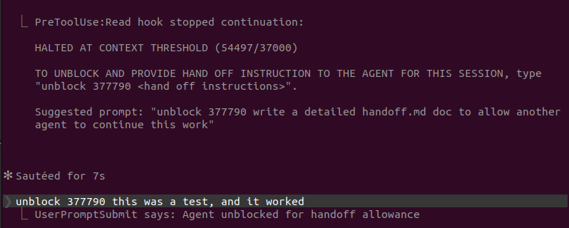

(AI agents should read `SKILL.md`; this `README.md` is about installation and is for users.)

# Claude Code Token Count

- Detect an early token threshold to prevent hitting context limit or compacting accidentally.
- Report Claude Code token usage from local session JSONL files.
- Integrate live-session token count tracking into other tooling and hooks.
- Claude Code session files include accurate token counts that are used to calculate token usage.
- Match Claude Code's displayed context usage with `last_usage.all_observed_tokens`.



Suggested usage: install this skill once, then keep working normally. If you notice a Claude Code session's context getting high, for example above 600k tokens, ask the agent to set up the token counting guard for that project.

## Index

- [Install](#install)
- [Quick Start](#quick-start)
- [Manual And Tooling Use](#manual-and-tooling-use)
- [Install The Token Gate Hook](#install-the-token-gate-hook)
- [Notes](#notes)
- [License](#license)

## Install

Clone directly into the Claude Code user-level skills folder:

```bash
# Linux
git clone https://github.com/randyhaylor/claude-code-token-count.git ~/.claude/skills/claude-code-token-count
```

```bash
# macOS
git clone https://github.com/randyhaylor/claude-code-token-count.git ~/.claude/skills/claude-code-token-count
```

```cmd
REM Windows (Command Prompt)
git clone https://github.com/randyhaylor/claude-code-token-count.git "%USERPROFILE%\.claude\skills\claude-code-token-count"
```

```powershell
# Windows (PowerShell)
git clone https://github.com/randyhaylor/claude-code-token-count.git "$env:USERPROFILE\.claude\skills\claude-code-token-count"
```

## Quick Start

After installing the skill, ask Claude Code to set up or manage the guard in the current project with prompts like:

```text
Set up token count blocking for this project.
```

```text
Set up token count blocking for this project with a 900000 token limit.
```

```text
Update the token count blocking limit for this project to 750000.
```

```text
Remove token count blocking for this project.
```

Tip: do not grant Claude broad or permanent permission to edit the project `.claude/` folder. The hook settings and `usage.json` live there; unrestricted access could let the agent alter or remove the gate and circumvent the block.

## Manual And Tooling Use

The scripts use only the Python standard library, so they can be called directly from shell scripts, CI jobs, local tools, or custom Claude Code hooks.

Use `get_token_count.py` when you want a read-only token report:

```bash
python3 scripts/get_token_count.py --cwd /path/to/project --session-id <session-id> --json
```

The compact JSON includes:

```json
{
  "last_usage": {
    "all_observed_tokens": 357830,
    "input_side_tokens": 357480
  },
  "usage_blocks": 133,
  "duplicate_usage_blocks_skipped": 145
}
```

Use `token_usage_gate.py` as a `PreToolUse` hook or any automation that can provide a Claude Code hook-style JSON payload on stdin. It reads `transcript_path`, updates `<project>/.claude/usage.json`, and emits hook control JSON on stdout:

```bash
printf '%s' '{"session_id":"...","transcript_path":"/path/to/session.jsonl","cwd":"/path/to/project","hook_event_name":"PreToolUse","tool_name":"Read","tool_input":{}}' \
  | python3 scripts/token_usage_gate.py --threshold 900000
```

Use `unblock_via_prompt.py` as a `UserPromptSubmit` hook. It watches for `unblock <code> <instructions>`, validates the code in `<project>/.claude/usage.json`, and grants a short handoff window.

## Install The Token Gate Hook

In your project, create or edit `.claude/settings.local.json`. If the file already exists, merge these hooks into it and preserve any existing settings or hook commands:

```json
{
  "hooks": {
    "PreToolUse": [
      {
        "matcher": "",
        "hooks": [
          {
            "type": "command",
            "command": "python3 /absolute/path/to/claude-code-token-count/scripts/token_usage_gate.py --threshold 900000"
          }
        ]
      }
    ],
    "UserPromptSubmit": [
      {
        "hooks": [
          {
            "type": "command",
            "command": "python3 /absolute/path/to/claude-code-token-count/scripts/unblock_via_prompt.py"
          }
        ]
      }
    ]
  }
}
```

Change `--threshold 900000` per project if you want a different early-context cutoff.

The gate writes and updates:

```text
<project>/.claude/usage.json
```

When the session reaches the threshold, the hook blocks tool calls and shows:

```text
HALTED AT CONTEXT THRESHOLD (<used>/<limit>): The agent must wait and not say or do anything without further user direction

TO UNBLOCK AND PROVIDE HAND OFF INSTRUCTION TO THE AGENT FOR THIS SESSION, type "unblock <code> <hand off instructions>".

Suggested prompt: "unblock <code> write a detailed handoff.md doc to allow another agent to continue this work"
```

By default the gate uses hard-stop behavior: it returns top-level `continue:false` and `stopReason`; it ends the whole turn, and the agent prints nothing. To use the older behavior that only denies the current tool call and lets the agent explain, add `--behavior deny` to the hook command.

To allow a short handoff window, submit:

```text
unblock 123456 write a handoff document
```

The block message includes a suggested prompt:

```text
unblock 123456 write a detailed handoff.md doc to allow another agent to continue this work
```

Use the six-digit code from `.claude/usage.json`.

## Notes

Claude Code hook payloads include `transcript_path`, which points at the current session JSONL. The scripts read that file for `message.usage` token breadcrumbs. Treat the transcript JSONL as read-only; editing it is not a reliable way to change a Claude Code session.

## License

MIT
